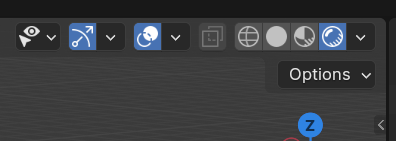

# AVT-ECoClass-VR - 3D models and scans
If downloaded correctly either by using the download tool or directly from [https://avtshare01.rz.tu-ilmenau.de/avt-ecoclass-vr/](https://avtshare01.rz.tu-ilmenau.de/avt-ecoclass-vr/), the folder `3d_scans` contains the 3D scans of 20 different persons.
You can open them directly in Blender (download from [here](https://www.blender.org/download)).
To also display the texture with a lighting, you need to enable the function "Viewport Shading" in the top right corner of Blender:

