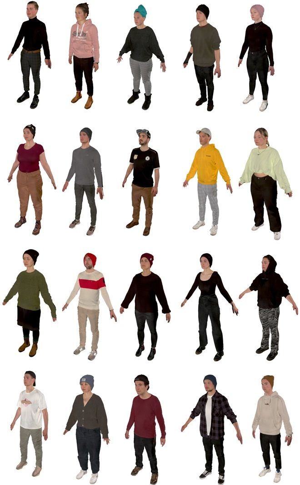

# AVT-ECoClass-VR
[](https://zenodo.org/badge/latestdoi/754167011)

This is a repository with data related to the AVT-ECoClass-VR database that is published at the IEEE QoMEX 2024 conference.
However, to download some contents of the dataset it is needed to use the provided tool, because they could not be hosted in this repository.
This work is funded by the Deutsche Forschungsgemeinschaft (DFG, German Research Foundation) - Project ECoClass-VR (DFG-444697733).

If you use any of the data or code please cite the following paper:

```bibtex
@inproceedings{fremerey2024avt,
    author = {Stephan Fremerey and Carolin Breuer and Larissa Leist and Maria Klatte and Janina Fels and Alexander Raake},
    title = {AVT-ECoClass-VR: An open-source audiovisual 360$^\circ$ video and immersive CGI multi-talker dataset to evaluate cognitive performance},
    booktitle={2024 16th International Conference on Quality of Multimedia Experience (QoMEX)},
    pages={1--7},
    year={2024},
    organization={IEEE}
}
```

## Description
The dataset is part of the project [ECoClass-VR](https://www.tu-ilmenau.de/en/university/departments/department-of-electrical-engineering-and-information-technology/profile/institutes-and-groups/audiovisual-technology-group/research/dfg-projekt-ecoclass-vr) to assess how complex visual and acoustic scenes affect cognitive performance in classroom scenarios, across age groups from children to adults.
As of now, most studies have examined rather simple acoustic and visual representations, which do not reflect the reality of school children.
An adapted version of the audiovisual scene analysis paradigm is presented in this dataset, focusing on the localization and identification of talkers within a scene.
The dataset includes two audiovisual scenarios (360° video and computer-generated imagery) and two implementations for dataset playback.
The 360° video part of the dataset features 200 video and single-channel audio recordings of 20 speakers reading ten stories, and 20 videos of speakers in silence, resulting in a total of 220 video and 200 audio recordings.
The dataset also includes one 360° background image of a real primary school classroom scene and a 3D model of the same classroom scene, targeting young school children for subsequent subjective tests.
All stories were recorded in the German language with native German speakers.
The second part of the dataset comprises 20 different 3D models of the speakers and a computer-generated classroom scene, along with an immersive audiovisual virtual environment implementation that can be interacted with using an HTC Vive controller.
Both implementations also include a Unity plugin to connect and interact with the [Virtual Acoustics](https://www.virtualacoustics.org) auralization framework, developed by the Institute for Hearing Technology and Acoustics (IHTA) at RWTH Aachen University.
As a proof of concept, the dataset includes example output data collected from ongoing perception tests.
There, subjects have the task of identifying which talker in the scene is reading out which story, using the story-to-speaker mapping input system developed within this dataset.

## Structure
To obtain the following folder structure, you need to at first execute the respective [download tool](#download-tool).

* `360_videos`
    * `360_video_recordings`: 220 different video recordings (MOV, GoPro CineForm HD codec, 7680x3840, 29.97 fps), 360° image of the classroom
    * `360_video_samples`: Set of 65 pre-rendered 360° video recordings for 5 subjects in ERP format encoded with libx265 and CRF of 1 (MP4, HEVC codec, 7680x3840, 29.97 fps)
    * `miscellaneous`: Python scripts for potential generation of further 360° video recordings and JSON files
* `3d_models_scans`
    * `3d_scans`: Non-rigged 3D scans of 20 different persons
    * `rigged_3d_models`: Rigged 3D models of 20 different persons
    * `school`: 3D model of classroom in DAE and SKP data format; **NEW** also available in Blender, FBX binary and glTF 2.0 file format
* `audio`: 200 different single-channel audio recordings (WAV, pcm_s24le codec, 48000 Hz) and the German stories in text format
* `ecoclass-vr_av-sa_360` : 360° implementation of the IVE
* `ecoclass-vr_av-sa_cgi`: CGI implementation of the IVE
* `subjective_data`: Example output data from 5 subjects
    * `av-sa_360_binaural`: Example output data (head rotation and speaker-to-story mappings) for the 360° IVE (binaural audio condition)
    * `av-sa_cgi_binaural`: Example output data (head rotation and speaker-to-story mappings) for the CGI IVE (binaural audio condition)

Please cf. the paper for more details and the README of the respective IVE to get more information on how to get them running.

## Dataset overview

### 360° video overview

*Example 360° images of all 20 speakers in the dataset*


*360° image of the recorded classroom*

### 3D scans overview


*3D scan preview images of all 20 speakers in the dataset*

### Preview 360° video contents

*Example 360° 5s long video snippet of a rendered sequence with 20 speakers*

## Download Tool
At first, you need to clone this repository.
Then, you need to use the provided download tool for your system to download all the contents which could not be hosted in this repository and extract them.
Please bear in mind that the total size of the dataset is about 3.7 TB.

Under Linux, you need `wget` and `unzip` installed and then execute the Shell-script.

```bash
./download.sh
```

Under Windows, you need to at first open a cmd or terminal session and then execute the Batch script:

```bat
.\download.bat
```

This will automatically download and extract all contents to their respective folders as described above in "Structure".

As an alternative to using the provided download tool or if you only want to download parts of the dataset, you may also manually download all contents you need. They can be found here: [https://avtshare01.rz.tu-ilmenau.de/avt-ecoclass-vr/](https://avtshare01.rz.tu-ilmenau.de/avt-ecoclass-vr/)

## License
The contents of the database follow the [Attribution-NonCommercial 4.0 International (CC BY-NC 4.0)](https://creativecommons.org/licenses/by-nc/4.0/) license.

The dataset is part of a publication at the IEEE QoMEX 2024 conference (see above).