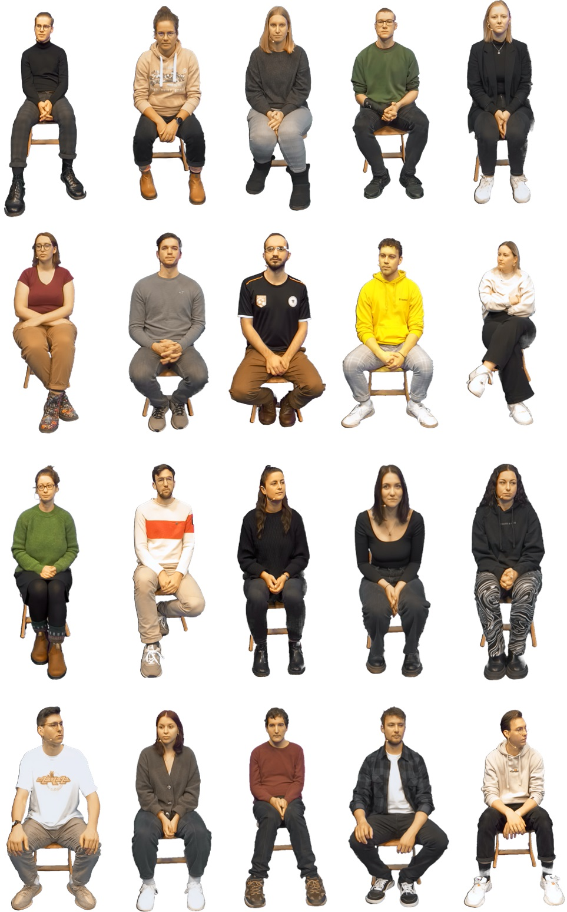
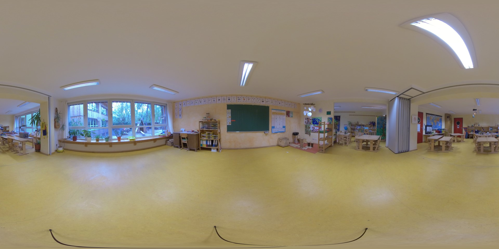

# AVT-ECoClass-VR
This is a repository with data related to the AVT-ECoClass-VR database that is published at the IEEE QoMEX 2024 conference.
However, to download some contents of the dataset it is needed to use the provided tool, because they could not be hosted in this repository.
This work is funded by the Deutsche Forschungsgemeinschaft (DFG, German Research Foundation) - Project ECoClass-VR (DFG-444697733).

If you use any of the data or code please cite the following paper:

```bibtex
@inproceedings{fremerey2024avt,
    author = {Stephan Fremerey and Carolin Breuer and Larissa Leist and Maria Klatte and Janina Fels and Alexander Raake},
    title = {AVT-ECoClass-VR: An open-source audiovisual 360$^\circ$ video and immersive CGI multi-talker dataset to evaluate cognitive performance},
    booktitle="2024 16th International Conference on Quality of Multimedia Experience (QoMEX)",
    year = {2024},
    note = {to appear}
}
```

## Structure
To obtain the following structure, you need to at first execute the respective download tool.

* `360_videos`
    * `360_video_recordings`: 220 different video recordings, 360° image of the classroom
    * `360_video_samples`: Set of 65 pre-rendered 360° video recordings for 5 subjects in ERP format encoded with libx265 and CRF of 1
    * `miscellaneous`: Python scripts for potential generation of further 360° video recordings and JSON files
* `3d_models_scans`
    * `3d_scans`: Non-rigged 3D scans of 20 different persons
    * `rigged_3d_models`: Rigged 3D models of 20 different persons
    * `school`: 3D model of classroom in DAE and SKP data format
* `audio`: 200 different single-channel audio recordings
* `ecoclass-vr_av-sa_360` : 360° implementation of the IVE
* `ecoclass-vr_av-sa_cgi`: CGI implementation of the IVE
* `subjective_data`: Example output data from 5 subjects
    * `av-sa_360_binaural`: Example output data (head rotation and speaker-to-story mappings) for the 360° IVE (binaural audio condition)
    * `av-sa_cgi_binaural`: Example output data (head rotation and speaker-to-story mappings) for the CGI IVE (binaural audio condition)

Please cf. the README of the respective IVE to get more information on how to get them running.

## Dataset overview

### 360° video overview

*Example 360° images of all 20 speakers in the dataset*


*360° image of the recorded classroom*

### 3D scans overview
*3D scans of all 20 speakers in the dataset*

### Preview 360° video contents

*Example 360° 5s long video snippet of a rendered sequence with 20 speakers*

## Download Tool
Use the provided download tool for your system to get all the contents which could not be hosted in this repository and extract them.
Please bear in mind that the total size of the dataset is about 3.7 TB.

Under Linux, you need `wget` and `unzip` installed and then execute the Shell-script.

```bash
./download.sh
```

Under Windows, where the download speed could be slower, you need to at first open a PowerShell, then temporarily bypass the execution policy of your PC for this PowerShell session and then execute the batch script:

```bat
Set-ExecutionPolicy -Scope Process -ExecutionPolicy Bypass
.\download.bat
```

This will automatically download all contents to their respective folders as described above in "Structure".

As an alternative to using the provided download tool or if you only want to download parts of the dataset, you may also manually download all contents you need. They can be found here: [https://avtshare01.rz.tu-ilmenau.de/avt-ecoclass-vr/](https://avtshare01.rz.tu-ilmenau.de/avt-ecoclass-vr/)

## License
The contents of the database follow the [Attribution-NonCommercial 4.0 International (CC BY-NC 4.0)](https://creativecommons.org/licenses/by-nc/4.0/) license.

The dataset is part of a publication at the IEEE QoMEX 2024 conference (see above).